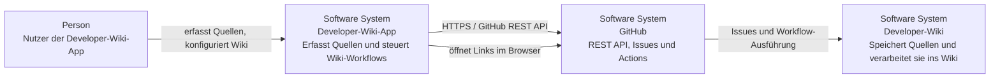
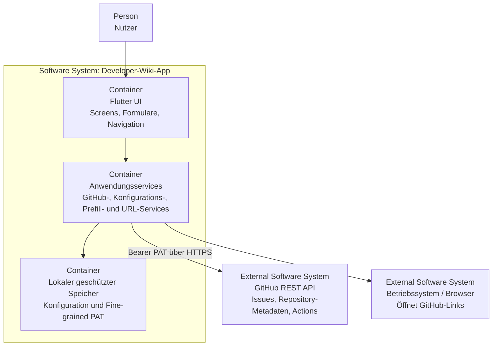

# Architektur

Die Architektur wird nach dem [C4-Modell](https://c4model.com/) dokumentiert. Für den aktuellen Projektumfang sind Systemkontext und Container-Sicht ausreichend; zusätzliche Ebenen werden erst ergänzt, wenn sie konkrete Orientierung bieten.

## Level 1 – Systemkontext

Die Developer-Wiki-App ist ein mobiler Client für ein persönliches Developer-Wiki auf GitHub. Sie erfasst strukturierte Quellen, legt daraus GitHub-Issues an und kann den Import-Workflow des Wiki-Repositories starten und beobachten. Die eigentliche Wiki-Verarbeitung bleibt außerhalb der App im Developer-Wiki.

### Verantwortungsgrenze

Die App ist bewusst nur Client. Importlogik, Archivierung und Wissensaufbereitung gehören in das Developer-Wiki-Repository. Die App kapselt GitHub-Zugriffe und hält keine eigene serverseitige Infrastruktur vor.

## Level 2 – Container-Sicht

Da die Anwendung eine einzelne Flutter-App ohne eigenes Backend ist, werden hier die wesentlichen Laufzeit- und Integrationsbereiche als Container dargestellt.

## Zentrale Architekturregeln

- UI, fachliche Abläufe, Persistenz und externe Kommunikation bleiben getrennt.
- GitHub-API-Aufrufe werden zentral über Services gekapselt; Screens bauen keine HTTP-Requests selbst zusammen.
- Das Fine-grained PAT wird lokal über den geschützten Plattform-Speicher abgelegt und nicht geloggt oder im Repository gespeichert.
- Unterschiedliche Einstiegspunkte, etwa normale Erfassung und Android Share, verwenden denselben fachlichen Erfassungsweg.
- Konfigurierbare Werte wie Ziel-Repository und Workflow-Datei werden nicht unnötig im UI-Code fest verdrahtet.
- Die Architektur bleibt mobile-first, testbar und so einfach wie für den aktuellen Funktionsumfang möglich.

## Pflege

Wenn sich Systemgrenzen, Integrationen, Persistenz oder zentrale Verantwortlichkeiten ändern, müssen die betroffenen C4-Sichten im selben Pull Request aktualisiert werden. Neue Diagramme werden bevorzugt als Mermaid gepflegt; SVG ist zulässig, wenn ein textbasiertes Diagramm nicht sinnvoll ist.
